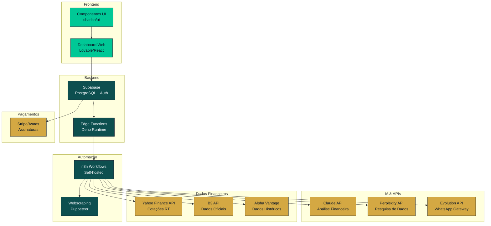
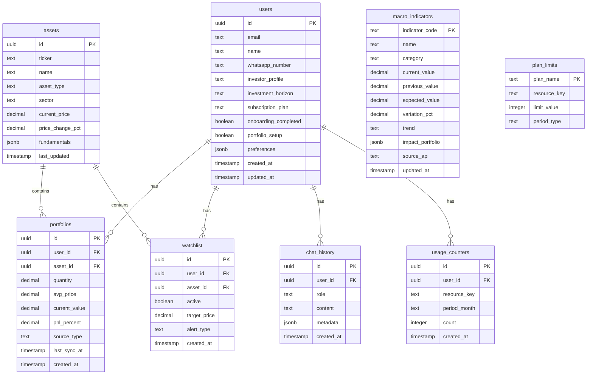
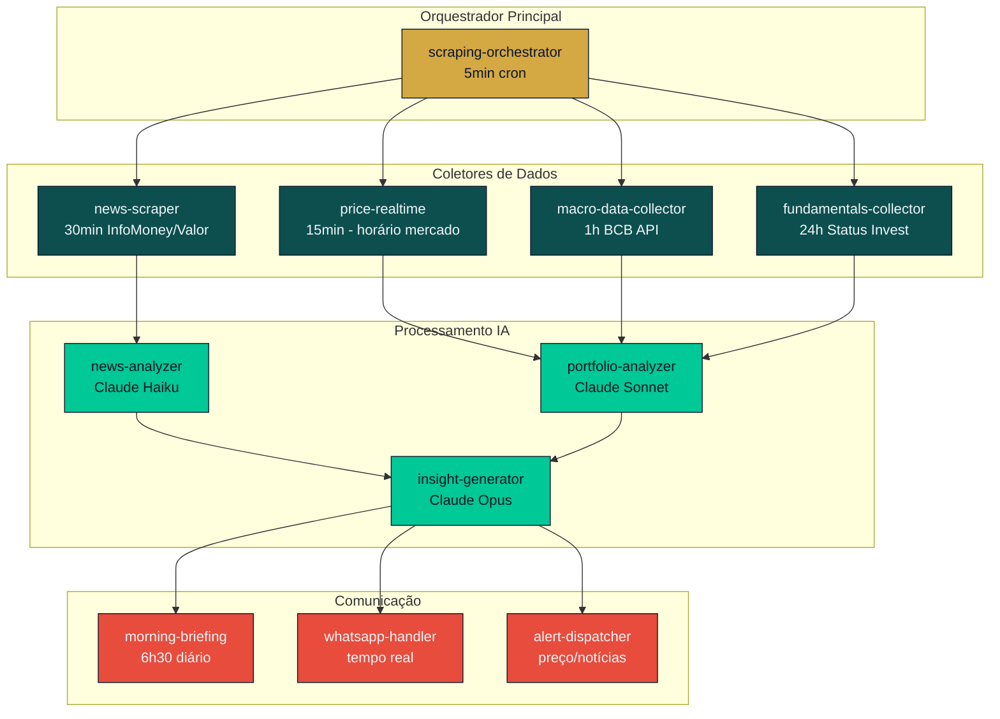
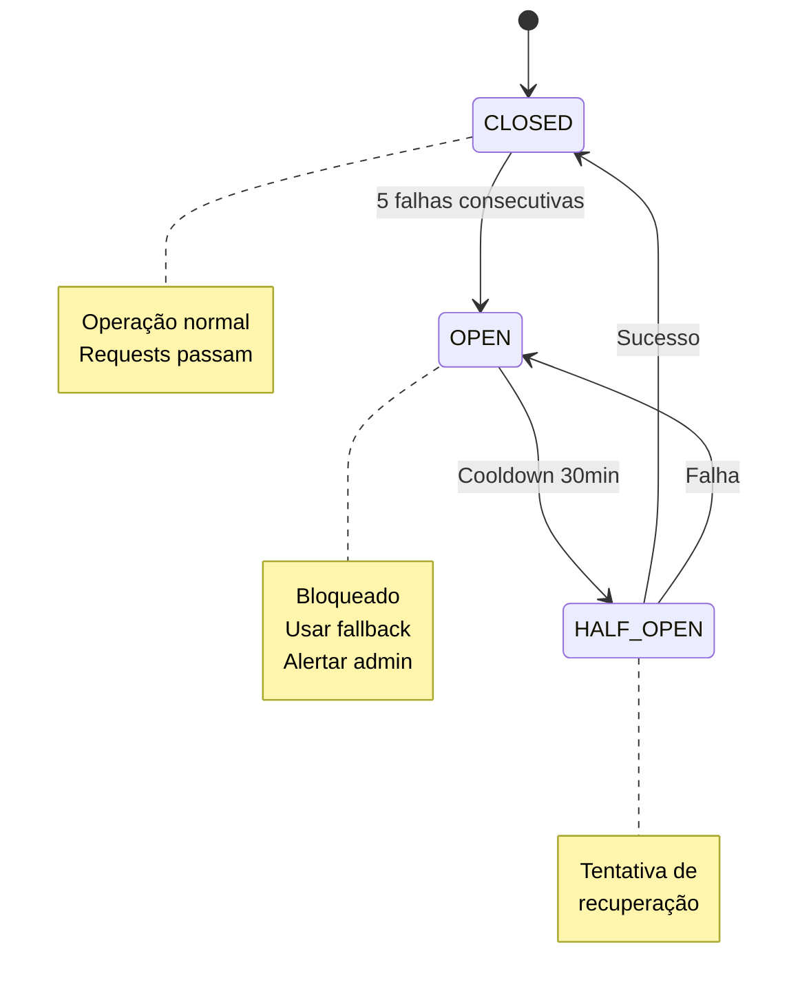
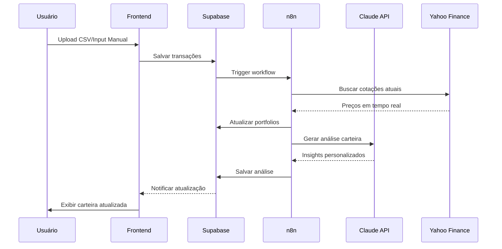
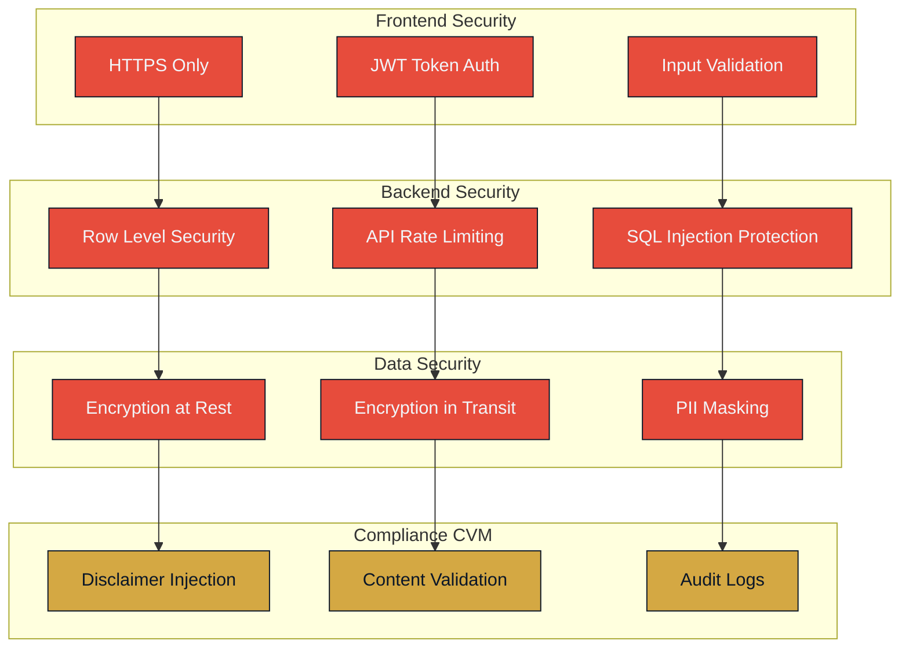
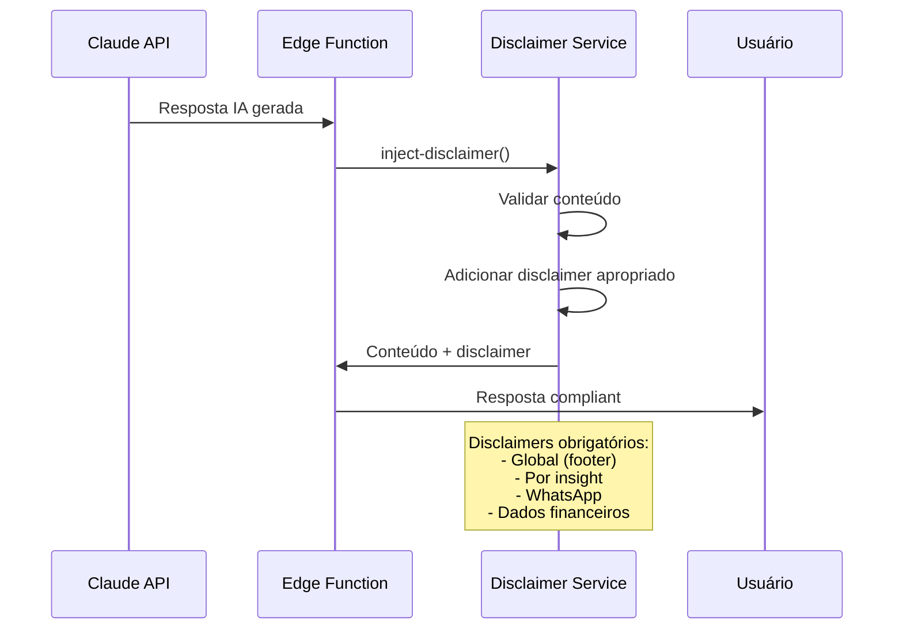
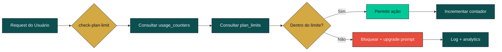
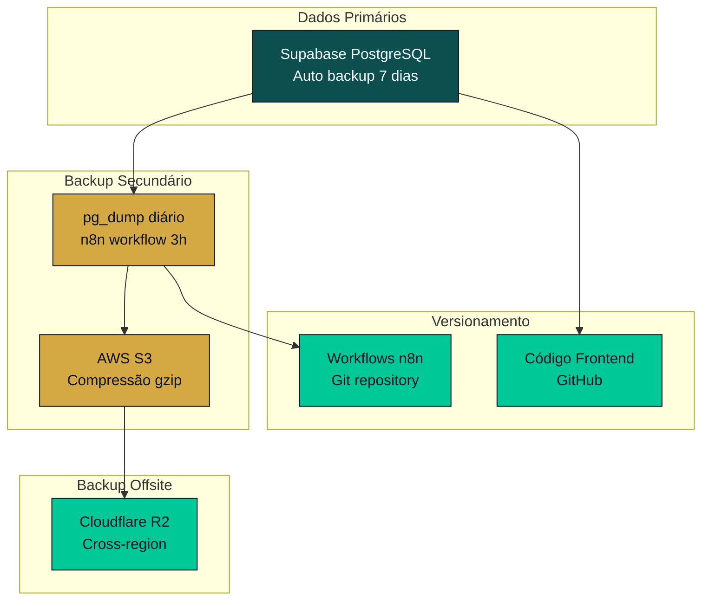

# Arquitetura do Sistema

# Documentação de Arquitetura - AUREA

## 1. Visão Geral da Arquitetura

A plataforma AUREA é um assistente financeiro inteligente que combina análise macroeconômica com monitoramento de carteiras pessoais. A arquitetura foi projetada para ser escalável, segura e aderente às regulamentações CVM.



## 2. Arquitetura de Dados

### 2.1 Modelo de Dados Principal (Supabase)



### 2.2 Políticas de Row Level Security (RLS)

```sql
-- Exemplo de política RLS para tabela portfolios
CREATE POLICY "Users can only see their own portfolio" 
ON portfolios FOR ALL 
TO authenticated 
USING (auth.uid() = user_id);

-- Política para dados públicos (macro_indicators)
CREATE POLICY "Macro indicators are public" 
ON macro_indicators FOR SELECT 
TO authenticated 
USING (true);
```

## 3. Arquitetura de Microserviços e Workflows

### 3.1 Sistema de Workflows n8n



### 3.2 Circuit Breaker Pattern para APIs Externas



## 4. Fluxo de Dados e Integrações

### 4.1 Fluxo de Sincronização de Carteira



### 4.2 Fluxo de Briefing Matinal

```mermaid
flowchart TD
    A[Cron Job 6h30] --> B[Buscar indicadores macro]
    B --> C[Buscar notícias relevantes]
    C --> D[Analisar carteira usuário]
    D --> E[Gerar briefing personalizado]
    E --> F{Usuário tem WhatsApp?}
    F -->|Sim| G[Enviar via Evolution API]
    F -->|Não| H[Salvar no dashboard]
    G --> I[Marcar como enviado]
    H --> I
    I --> J[Log de entrega]
    
    classDef process fill:#0D4F4F,stroke:#0A1628,color:#F1F5F9
    classDef decision fill:#D4A843,stroke:#0A1628,color:#0A1628
    classDef endpoint fill:#00C896,stroke:#0A1628,color:#0A1628
    
    class A,B,C,D,E process
    class F decision  
    class G,H,I,J endpoint
```

## 5. Segurança e Compliance

### 5.1 Camadas de Segurança



### 5.2 Sistema de Disclaimers CVM



## 6. Planos de Assinatura e Enforcement

### 6.1 Sistema de Limites por Plano



### 6.2 Matriz de Recursos por Plano

| Recurso | Free | Essential (R$49,90) | Premium (R$149,90) | Advisory (R$499,90) |
|---------|------|--------------------|--------------------|-------------------|
| Watchlist | 5 ativos | 20 ativos | 999 ativos | Ilimitado |
| Consultas chat/mês | 0 | 10 | Ilimitado | Ilimitado |
| Insights por dia | 3 (macro) | 10 | Ilimitado | Ilimitado |
| Tipo briefing | Básico | Completo | Completo + alertas | Completo + prioritário |
| Sincronização carteira | Manual | Manual + CSV | Manual + CSV + API | Manual + CSV + API + Open Finance |
| Upload documentos | ❌ | ❌ | ✅ | ✅ |
| Comparação ativos | ❌ | ❌ | ✅ (3 ativos) | ✅ (ilimitado) |
| Relatório PDF semanal | ❌ | ❌ | ✅ | ✅ |
| Modelo IA | Haiku | Sonnet | Sonnet | Opus |
| Suporte | FAQ | Email 48h | Email 24h + chat | Email 4h + WhatsApp |

## 7. Backup e Disaster Recovery

### 7.1 Estratégia 3-2-1



**Retenção:**
- Diário: 30 dias
- Semanal: 6 meses  
- Mensal: 2 anos

**SLAs:**
- RTO (Recovery Time): 4 horas
- RPO (Recovery Point): 24 

---
*Tipo: architecture*
*Gerado pelo ForgeAI em 13/02/2026*
